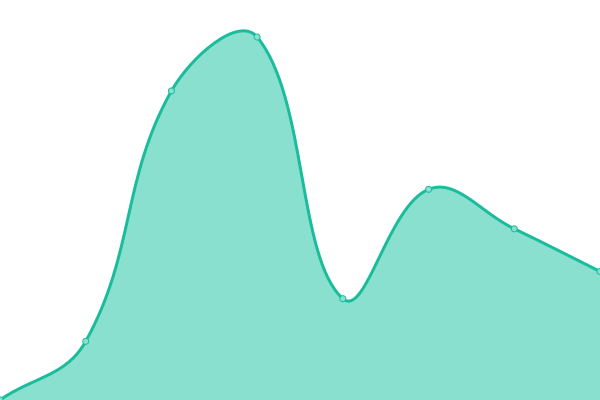
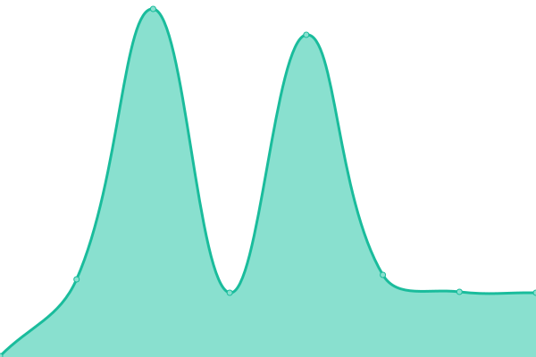

# [📈 Live Status](https://monitor.b23.fun): <!--live status--> **🟧 Partial outage**

This repository contains the open-source uptime monitor and status page for [Upptime](https://upptime.js.org), powered by [Upptime](https://github.com/upptime/upptime).

With [Upptime](https://upptime.js.org), you can get your own unlimited and free uptime monitor and status page, powered entirely by a GitHub repository. We use [Issues](https://github.com/upptime/upptime/issues) as incident reports, [Actions](https://github.com/Just-test-it/monitor/actions) as uptime monitors, and [Pages](https://monitor.b23.fun) for the status page.

<!--start: status pages-->
<!-- This summary is generated by Upptime (https://github.com/upptime/upptime) -->
<!-- Do not edit this manually, your changes will be overwritten -->
<!-- prettier-ignore -->
| URL | Status | History | Response Time | Uptime |
| --- | ------ | ------- | ------------- | ------ |
|  [Index](https://www.shiyunhong.com) | Up | [index.yml](https://github.com/Just-test-it/monitor/commits/HEAD/history/index.yml) | 

 1534ms
     
 | 

<a href="https://monitor.b23.fun/history/index">99.46%</a>
    

|  [小石同学(blog.shiyunhong.com)](https://blog.shiyunhong.com) | Up | [blog-shiyunhong-com.yml](https://github.com/Just-test-it/monitor/commits/HEAD/history/blog-shiyunhong-com.yml) | 

 845ms
     
 | 

<a href="https://monitor.b23.fun/history/blog-shiyunhong-com">100.00%</a>
    

|  My Aria2 Server | Down | [my-aria2-server.yml](https://github.com/Just-test-it/monitor/commits/HEAD/history/my-aria2-server.yml) | 

 26465ms
     
 | 

<a href="https://monitor.b23.fun/history/my-aria2-server">0.00%</a>
    

|  [小宋博客(cannon.org.cn)](https://cannon.org.cn) | Down | [cannon-org-cn.yml](https://github.com/Just-test-it/monitor/commits/HEAD/history/cannon-org-cn.yml) | 

 0ms
     
 | 

<a href="https://monitor.b23.fun/history/cannon-org-cn">0.00%</a>
    

|  [V2ex](https://v2ex.com) | Up | [v2ex.yml](https://github.com/Just-test-it/monitor/commits/HEAD/history/v2ex.yml) | 

 327ms
     
 | 

<a href="https://monitor.b23.fun/history/v2ex">100.00%</a>
    

|  [Google](https://www.google.com) | Up | [google.yml](https://github.com/Just-test-it/monitor/commits/HEAD/history/google.yml) | 

 120ms
     
 | 

<a href="https://monitor.b23.fun/history/google">100.00%</a>
    

|  [Wikipedia](https://zh.wikipedia.org) | Up | [wikipedia.yml](https://github.com/Just-test-it/monitor/commits/HEAD/history/wikipedia.yml) | 

 249ms
     
 | 

<a href="https://monitor.b23.fun/history/wikipedia">100.00%</a>
    

|  [Hacker News](https://news.ycombinator.com) | Up | [hacker-news.yml](https://github.com/Just-test-it/monitor/commits/HEAD/history/hacker-news.yml) | 

 275ms
     
 | 

<a href="https://monitor.b23.fun/history/hacker-news">100.00%</a>
    

<!--end: status pages-->

[**Visit our status website →**](https://monitor.b23.fun)

## 📄 License

- Powered by: [Upptime](https://github.com/upptime/upptime)
- Code: [MIT](./LICENSE) © [Upptime](https://upptime.js.org)
- Data in the `./history` directory: [Open Database License](https://opendatacommons.org/licenses/odbl/1-0/)
